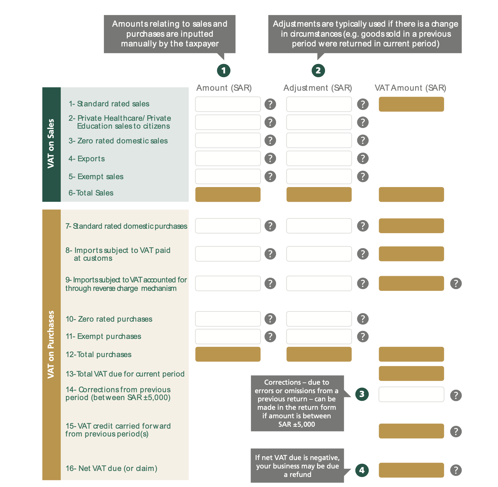
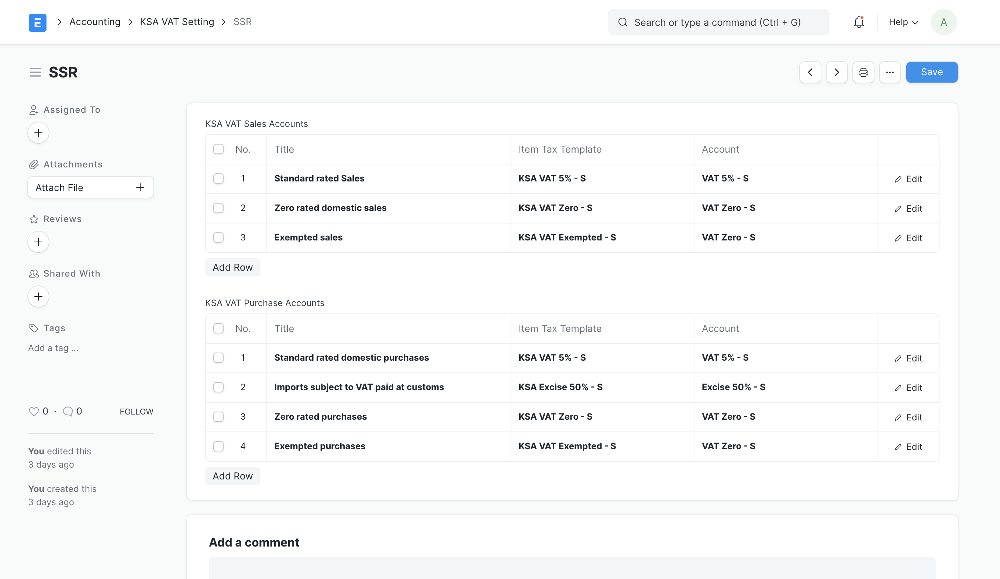
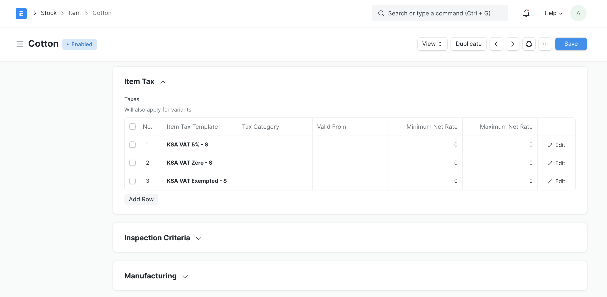
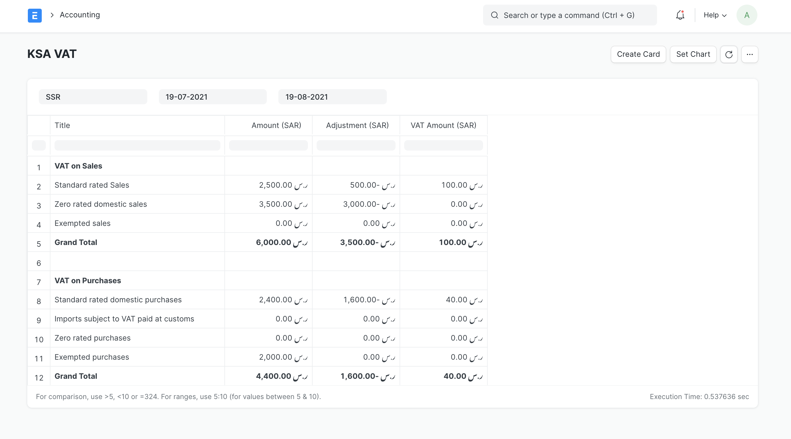

## KSA E-Invoicing

On creation of Sales Invoice. A qr code image will be generating and attached to the document. The QR code can we accessed in the print format. Scanning the QR Code will enable users to view the Sales Invoice default print format without logging into the system

Print Format view for the QR Code

Use the QR code in the Print format

Simplified VAT Invoice

## Simplified KSA VAT Management and Reporting

This app manages to generate report for the **VAT on Sales** and **VAT on Purchases** for Saudi Arab

Find the new card in the Accounting Workspace

On creation of the first company for the country Saudi Arab. KSA VAT Setting is created automatically. For any new companies create new settings setting.

KSA VAT Settings is mapping Item Tax Template and Account to the respective title to be shown in the report

Note: Multiple Item Tax Template can be set for each item. 

A good example in the sales cycle would be an item that is treated as a Standard rated Sales and as well as Zero rated domestic Sales. Same case can be applied on the purchase cycle.

Use the Item Tax Templates in the Sales and Purchase Invoice. The data should result in a similar KSA VAT Report

#### License

MIT
